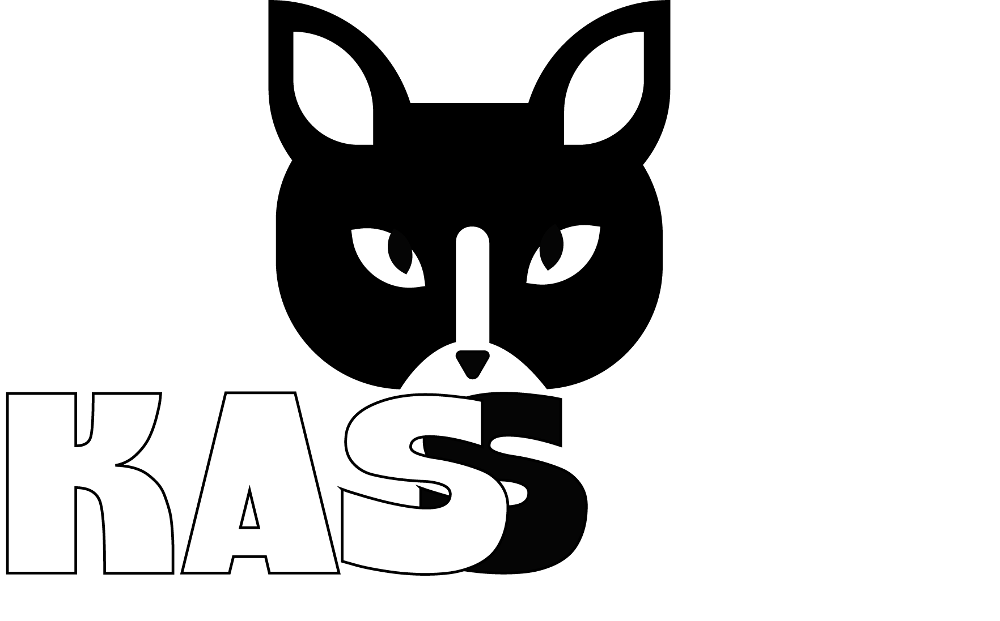
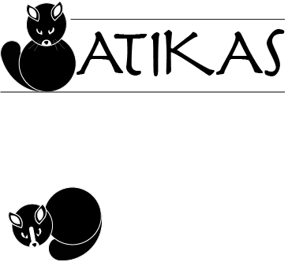
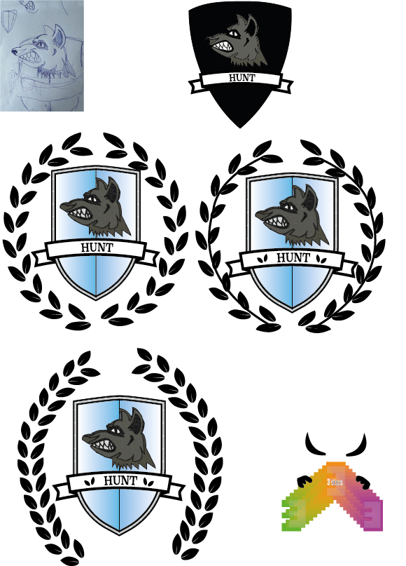
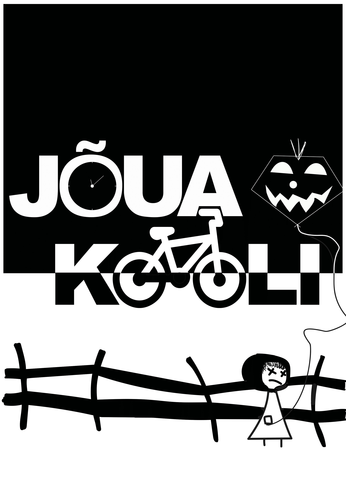

# Tunniteema = fondi oma käe järgi muutmine.

## Ruutudest tähed

## Hobi ja mu nimi
Siin on mu nimi kritseldatud koos mu hobiga.

## Logo ja kiri

## Apple logo
Siin on mu Apple uue logo disainid.

## Kass
Siin on minu tehtud kassi logo koos sõnaga "KASS"

## Siin on järgmine kass
Ülesandeks oli referentspildi järgi joonistada kass.

## Vapp
Siin oli vaja teha visandi ülejoonistamist.

## Negatiivne ruum, reversioon, esi-ja tagaplaan
Ülesandeks oli teha plakat kasutades negatiivset ruumi.

